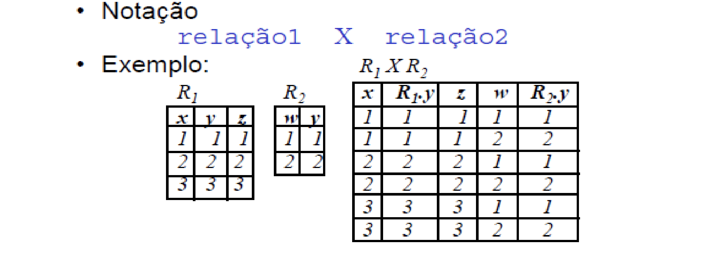

# SQL Básico

## Produto Cartesiano

É utilizado quando se deseja cruzar dados de duas relações diferentes.
Sintaxe: tabela1 × tabela2


SQL: select * from livros, edicao
SQL:  select * from livros CROSS JOIN edicao

Para cada linha de livro, combina-a com cada linha de edição
Ou seja, o produto cartesiano combina tudo com tudo

## Operações de Conjunto ( Operações Binárias )
`União, Intersecção e Diferença`
Para realizar essas operações, as duas relações precisam ser compatíveis.
Devem possuir o mesmo número de colunas e os domínios das respectivas colunas devem ser os mesmos.

### União
Contém todos os elementos pertencentes às relações originais sem duplicidade.
Sintaxe: tabela1 ∪ tabela2
Ex: Listar o nome e cpf de todos os médicos e de todos os pacientes
```sql
select nome, cpf from medicos union select nome, cpf from pacientes
```

### Intersecção
`tabela1 ∩ tabela2`  
A fim de obter uma relação resultante com os registros em comum.
Ex: Listar o nome e cpf de todos os médicos que são pacientes:
```sql
select nome, cpf from medicos intersect select nome, cpf from pacientes
```
### Diferença
`tabela1 − tabela2`  
Resulta nas tuplas presentes na primeira e ausentes na segunda.
Ex: Listar o nome e cpf de todos os médicos que não são pacientes:
```sql
select nome, cpf from medicos except select nome, cpf from pacientes
```
## Junções
Natural, interna ou externa
Consiste na operação de seleção aplicada ao produto cartesiano.

### Natural Join
É feita a a comparação interna de todas as colunas com nomes iguais.

### Inner Join
Definimos explicitamente o predicado da junção ( Geralmente com primary keys e foreign keys)

### Outer Join
Preseva o resultado mesmo das relações que não são combinadas 
